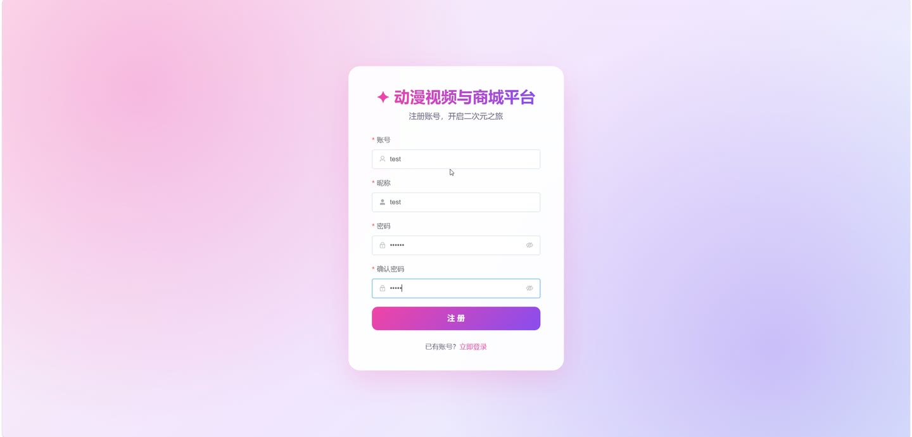
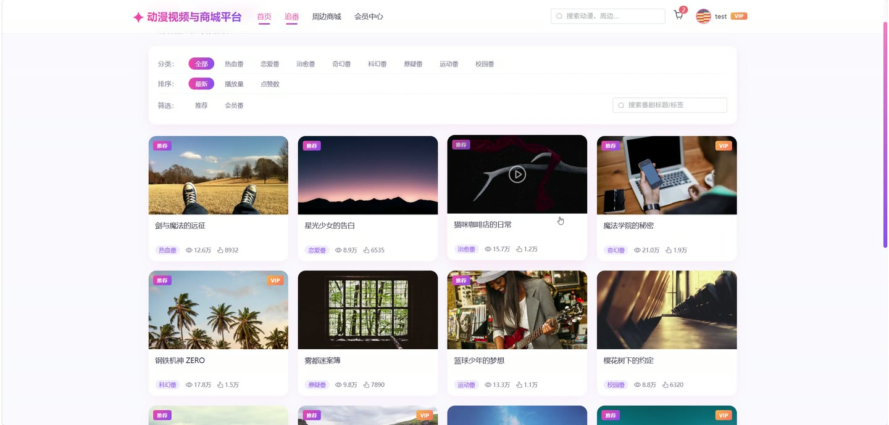
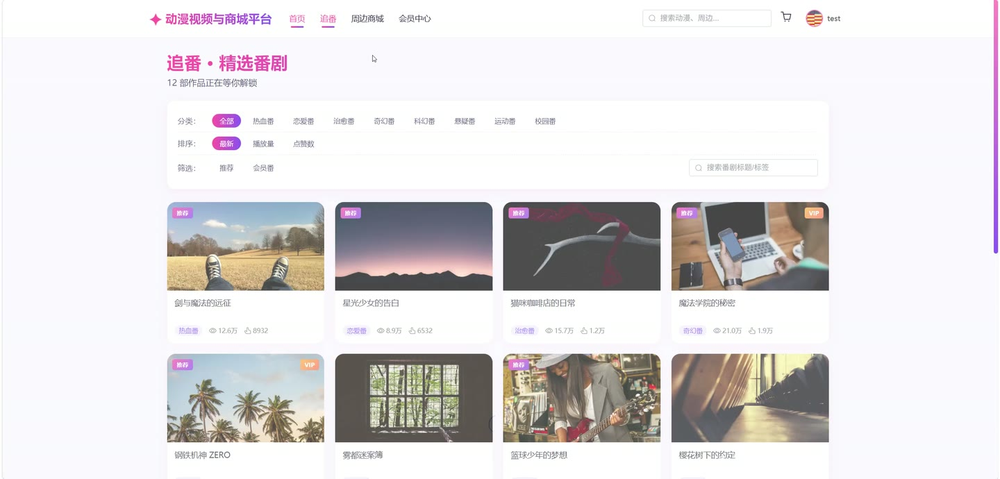
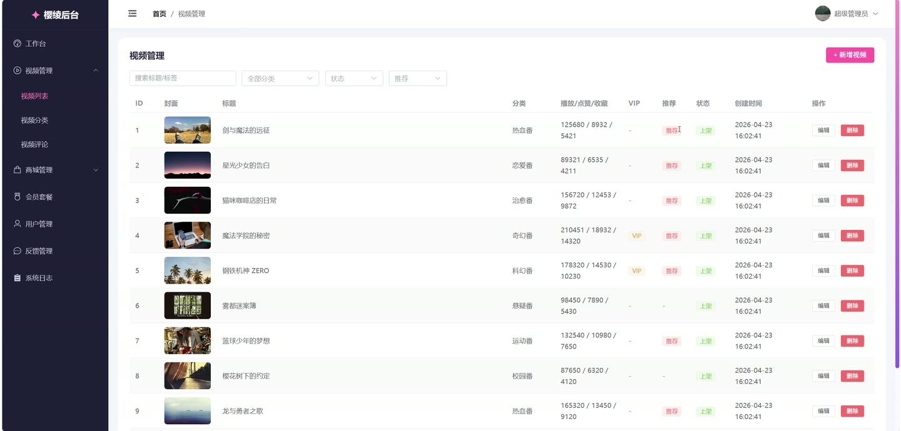
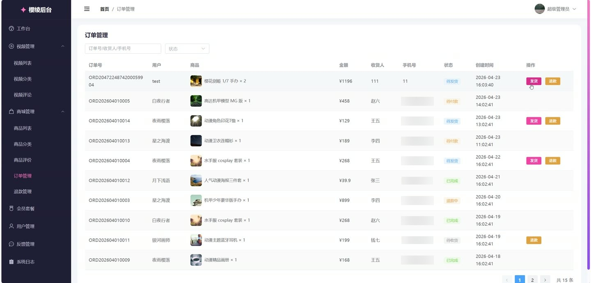
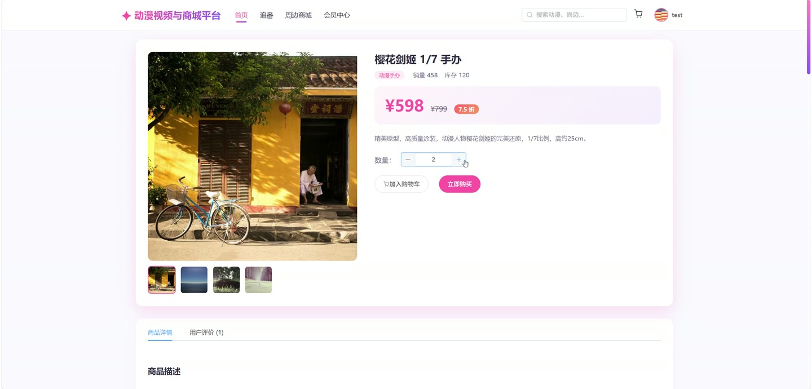

# (附文档)Springboot3+Vue3 动漫视频与商城平台

**技术栈**：Springboot3、Vue3

### 系统简介

本系统是一个基于 Spring Boot 3 + Vue 3 前后端分离的动漫视频与商城综合平台。平台包含用户端（视频播放、商品购买、会员开通）和管理端（视频/商品/订单/评论/退款管理），支持用户注册登录、视频观看与互动、商品购买与订单流转、会员体系等完整业务链路。
 
### 核心功能
 
### 用户端

 
- 用户注册与登录：支持用户名密码注册/登录，JWT Token 鉴权，登录后自动获取用户身份。 
- 个人资料管理：查看与修改昵称、头像、手机、邮箱、性别、生日、个性签名等个人信息。 
- 密码修改：输入旧密码与新密码完成密码变更，支持管理员端密码修改。 
- 会员开通：选择会员套餐（按月/季/年），调用开通接口后用户自动获得 VIP 身份及有效期。 
- 视频分类浏览：按分类列表查询视频，分类支持排序字段，前端可展示分类导航。 
- 视频分页与搜索：支持按关键词、分类、推荐标记、VIP 专属、排序方式（播放量/时间等）分页查询视频。 
- 视频详情与播放：查看视频标题、描述、封面、播放地址、时长、标签，播放时自动增加播放量。 
- 视频点赞与收藏：对视频进行点赞/取消点赞，收藏/取消收藏，收藏状态实时切换。 
- 视频评论：登录用户可对视频发表评论，评论列表公开显示（含用户昵称与头像）。 
- 观看历史记录：自动记录用户观看进度（进度百分比），支持分页查看历史与一键清空历史。 
- 我的收藏：分页查看已收藏的视频列表，支持取消收藏操作。 
- 商品分类浏览：按分类列表查询商品，分类支持排序字段。 
- 商品分页与搜索：支持按关键词、分类、推荐标记、排序方式分页查询商品。 
- 商品详情：查看商品名称、描述、封面、轮播图、原价/售价、库存、销量、分类名称。 
- 商品评价查看：在商品详情页查看该商品的所有用户评价（含评分、内容、用户昵称与头像）。 
- 购物车管理：将商品加入购物车（指定数量），查看购物车列表（含商品信息），修改数量，批量删除。 
- 收货地址管理：新增/编辑收货地址（收件人、手机、省市区、详细地址），设置默认地址，删除地址。 
- 创建订单：从购物车勾选商品或直接购买单个商品，选择收货地址与备注，生成订单。 
- 订单支付：对待付款订单进行支付操作，订单状态变更为待发货。 
- 取消订单：待付款状态下可取消订单，状态变更为已取消。 
- 确认收货：待收货状态下确认收货，订单状态变更为已完成。 
- 申请退款：已支付订单可申请退款，填写退款原因与详细说明，订单进入退款中状态。 
- 查看退款记录：查看某订单的最新退款申请记录与审核状态。 
- 订单评价：已完成订单可对商品进行评分（1-5星）与文字评价。 
- 意见反馈：提交反馈类型、内容与联系方式，管理员可回复。
 
### 管理端

 
- 管理员登录：独立的管理员账号登录接口，返回 Token。 
- 管理员信息管理：查看与修改管理员昵称、头像，修改管理员密码。 
- 视频管理：新增/编辑/删除视频（标题、描述、封面、播放地址、分类、标签、时长、VIP 标识、推荐标记、上下架状态）。 
- 视频分类管理：新增/编辑/删除视频分类（名称、描述、图标、排序）。 
- 商品管理：新增/编辑/删除商品（名称、描述、封面、轮播图、分类、价格、库存、推荐标记、上下架状态）。 
- 商品分类管理：新增/编辑/删除商品分类（名称、图标、排序）。 
- 会员套餐管理：新增/编辑/删除会员套餐（名称、时长、价格、原价、描述）。 
- 订单管理：查看所有订单分页（含用户昵称），按关键词/状态筛选，执行发货操作，执行退款操作。 
- 退款审核：查看退款申请列表（含用户昵称与收货人），同意退款（恢复库存、订单置为已退款），拒绝退款（订单回滚至申请前状态）。 
- 视频评论管理：分页查看所有视频评论（含用户与视频信息），按关键词搜索，删除违规评论。 
- 商品评价管理：分页查看所有商品评价，删除违规评价。 
- 用户反馈管理：分页查看反馈列表（含用户昵称），按关键词/状态筛选，回复反馈，删除反馈。 
- 系统日志管理：分页查看操作日志（操作人、操作类型、操作描述、请求方法、参数、IP、耗时、状态），按关键词搜索，删除日志。 
- 概览统计：查看平台概览数据（用户数、视频数、商品数、订单数、交易金额等）。 
- 订单趋势：查看近 7 日订单数量与金额变化趋势。 
- 分类统计：按视频/商品分类统计数量。 
- 热门视频 Top10：查看播放量最高的 10 个视频。
 
### 技术栈

  后端框架 Spring Boot 3   ORM MyBatis-Plus   权限认证 JWT（Token 鉴权）   前端框架 Vue 3   状态管理 Pinia   构建工具 Vite   数据库 MySQL   缓存 Redis 
 
### 交付内容

 
- 后端完整源码 
- 前端完整源码 
- 数据库初始化脚本 
- 万字文档

## 界面展示

---

## 获取完整源码 + 万字文档

本仓库为项目介绍页。**完整前后端源码、数据库初始化脚本、万字项目文档**，请加微信 `kangkangcode`，或访问 [codekk.top](http://codekk.top) 获取。

可作课程设计 / 毕业设计参考，支持远程部署调试。